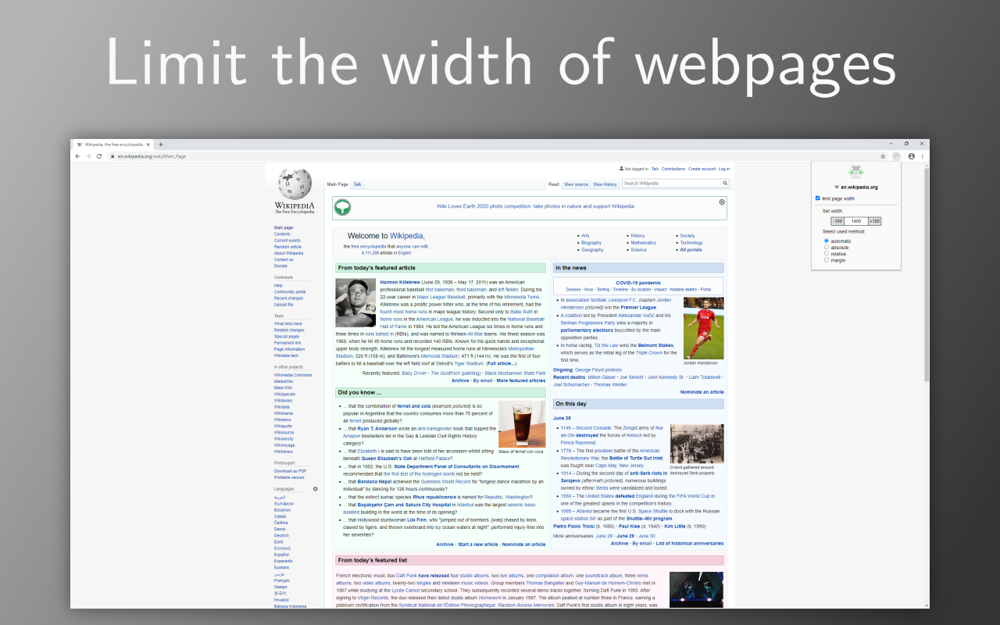

# widescreen-browsing
Some Webpages like Wikipedia insist on using the whole screen width, which makes them annoying to read. This extension reduces the width of webpages on screen. You can set a custom width per domain, which will be saved and automatically applied everytime you go to this domain. 

Limit the width of webpages | Save your settings per domain
:-------------------------:|:-------------------------:
  |   |  

Available on the Chrome Webstore and as a Firefox Addon soon!
